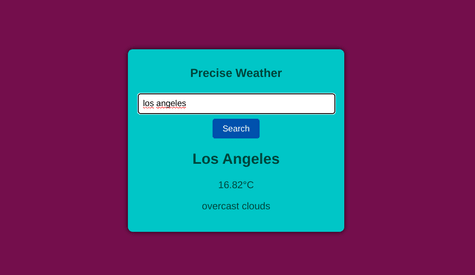

# Precise Weather

## Overview
This repository contains the source code for the Weather API Web app I created. The website is crafted using HTML ,CSS, and JavaScript showcasing my skills, projects, and more 😉. Anyone with basic understanding of HTML and JS can understand this minimalistic app.
## Features
- **Easy to Use**: I have provided explanations and Instructions on how to use and understand the app inside the source code as comments

- **Skill Display**: Showcase css skills and expertise in a visually appealing manner.
## Installation
1. Clone the repository:
   ```bash
   git clone https://github.com/sfndiku/weather-app.git
## Contact
Contact me via email <sfnbusiness00@gmail.com>

     
> PS. feel free to modify and use it for your own requirements
